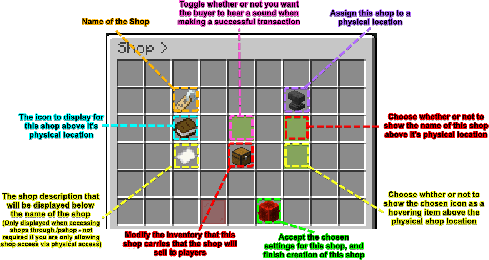

# Guide for the Various Player Interfaces

## Admin Shop Interface

Admin Shops can be accessed by using the following commands:

* `/shop` or `/shop [name of shop]` to open admin shops
    * To open the shop in the image below, you would type `/shop Specialty Shop`
    * Commands are ***not required*** to open admin shops. Instead, you can assign the shop to a physical block (*See **"Figure 1"** below*). See the [Admin-Shops-Options page ](https://jowcey.github.io/ExaltedEconomyWiki/Admin-Shops-Options/)for instructions on how to assign a shop to a physical block.

| *Figure 1: Physical Shop Location Example* |
| :---: |
| **Here is how a shop will look when assigned to a physical block**  |
|  |

| *Figure 2: example of an Admin Shop* |
| :---:| 
| Here is an example of the shop window|
||

---

## Acccessing a Player Shop

* `/pshop` to view all shops or `/pshop [name of player]` to open shops created by a specific player.
  * To open a you would type `/pshop [name of player who owns the shop]` then select the "`Specialty Shop`" from the list of shops for this player.
  * In the same manner as ***Admin Shops***, you can place a ***Player Shop*** in a physical location (*See "Figure 1" Above*).

---

## Creating a Player Shop

* You can create a player shop for yourself by typing `/pshop [YOUR NAME]`
* If you are an admin, you can modify shops created by other players by typing `/exaltedeconomy` or `/ee`, then visit the "Player Shop" section, select the owner of the desired shop in the list, then select the shop from the list.

* When creating a shop, take your time to fill in all of the following information.
*  **TO ADD ITEMS TO THE SHOP INVENTORY** for you to sell or buy, you must first enter all of the information then click the `GREEN SQUARE`  to create the shop. Then Modify your shop by **RIGHT CLICKING** the shop in the list.
   *  

| Here is the exanded descriptive view of shop creation |
| :---: |
| 